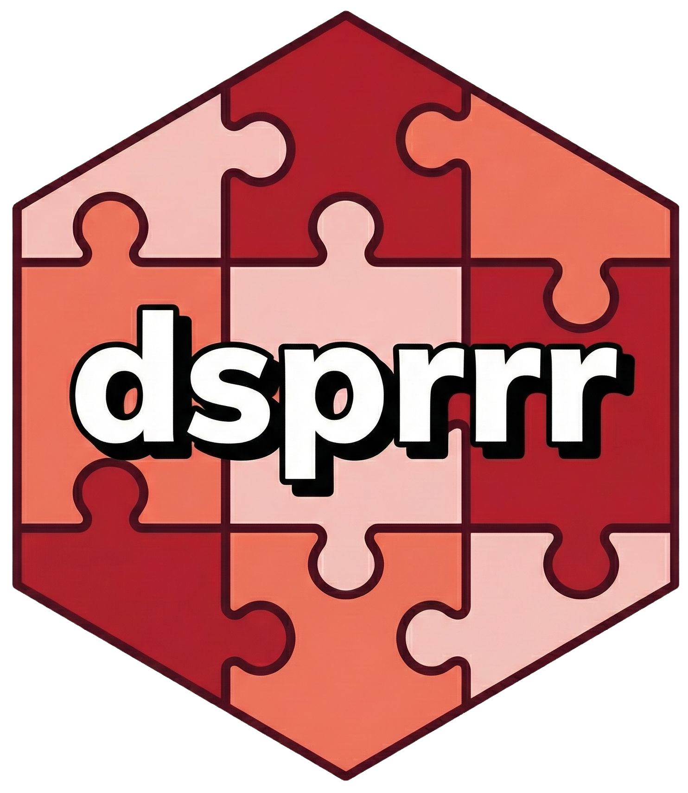

<!-- README.md is generated from README.Rmd. Please edit that file -->

```{r, include = FALSE}
knitr::opts_chunk$set(
  collapse = TRUE,
  comment = "#>",

  fig.path = "man/figures/README-",
  out.width = "100%"
)
```

# dsprrr 

<!-- badges: start -->
[](https://lifecycle.r-lib.org/articles/stages.html#experimental)
[](https://CRAN.R-project.org/package=dsprrr)
[](https://github.com/JamesHWade/dsprrr/actions/workflows/R-CMD-check.yaml)
[](https://app.codecov.io/gh/JamesHWade/dsprrr)
<!-- badges: end -->

**dsprrr** brings the power of [DSPy](https://github.com/stanfordnlp/dspy) to R, providing a framework for building **principled, test-driven, and optimizable** LLM applications. If you know [ellmer](https://ellmer.tidyverse.org), you already know dsprrr — it extends ellmer's patterns with signatures, optimization, and tracing.

## The Idea: From Prompts to Programs

Instead of wrestling with prompt strings, dsprrr lets you:

- **Declare** what you want using expressive signatures
- **Compose** modules into complex pipelines
- **Optimize** prompts automatically using your data
- **Trace** every LLM call for debugging and analysis

## Installation

```r
# install.packages("pak")
pak::pak("JamesHWade/dsprrr")
```

## Quick Start: Three Ways to Use dsprrr

### 1. Chat-First (ellmer users start here)

If you're coming from ellmer, `dsp()` feels familiar — it's like `chat$chat_structured()` but with signatures:

```{r chat-first, eval=FALSE}
library(dsprrr)
library(ellmer)

# Create a Chat as usual
chat <- chat_openai()

# Use dsp() for structured LLM calls with signatures
chat |> dsp("question -> answer", question = "What is 2+2?")
#> "4"

# Signatures define both input AND output structure
chat |> dsp(
  "text -> sentiment: enum('positive', 'negative', 'neutral')",
  text = "I love this package!"
)
#> "positive"

# Even simpler — auto-detect Chat from API keys
dsp("question -> answer", question = "What is the capital of France?
#> "Paris"
```

### 2. Module-Based (for reusable components)

When you need to reuse a configuration or optimize it later:

```{r module-based, eval=FALSE}
# Convert Chat to a reusable module
classifier <- chat_openai() |>
  as_module("text -> sentiment: enum('positive', 'negative', 'neutral')")

# Use it multiple times
classifier$predict(text = "Great product!")
#> "positive"

classifier$predict(text = "Terrible experience")
#> "negative"

# Batch processing
classifier$predict(text = c("Love it!", "Hate it!", "It's okay"))
#> c("positive", "negative", "neutral")

# tidymodels-style interface
predict(classifier, new_data = tibble(text = c("Amazing!", "Awful")))
```

### 3. Full DSPy-Style (for optimization workflows)

For systematic prompt optimization:

```{r dspy-style, eval=FALSE}
# Define signature and module
sig <- signature("context, question -> answer")
mod <- module(sig, type = "predict")

# Prepare training data
trainset <- dsp_trainset(

  context = c("R is a language for statistics.", "Python is versatile."),
  question = c("What is R for?", "Describe Python."),
  answer = c("Statistics", "Versatile programming")
)

# Optimize with few-shot examples
optimized <- compile_module(
  program = mod,
  teleprompter = LabeledFewShot(k = 2),
  trainset = trainset
)

# Run optimized module
optimized |> run(
  context = "dsprrr brings DSPy to R.",
  question = "What does dsprrr do?"
)
```

## Key Features

### Signatures: Declarative LLM Interfaces

```{r signatures-demo}
library(dsprrr)

# String notation — concise and expressive
signature("text -> sentiment")
signature("context, question -> answer: string")
signature("review -> rating: enum('1', '2', '3', '4', '5')")

# With instructions
signature(
 "text -> summary",
  instructions = "Be concise. Maximum 50 words."
)
```

### Tool Support with ReactModule

```{r react-module, eval=FALSE}
# Create tools using ellmer
search_tool <- ellmer::tool(
  function(query) search_api(query),
  name = "search",
  description = "Search for information",
  arguments = list(query = ellmer::type_string())
)

# Create a ReAct-style module with tools
agent <- signature("question -> answer") |>
  module(type = "react", tools = list(search_tool))

# The module automatically uses tools as needed
agent$predict(question = "What's the weather in NYC?")
```

### Streaming Support

```{r streaming, eval=FALSE}
mod <- signature("topic -> story") |> module(type = "predict")

# Stream with callback
mod$stream(topic = "a robot learning to paint", callback = cat)

# Or get a generator for manual consumption
gen <- mod$stream(topic = "space exploration")
coro::loop(for (chunk in gen) {
  cat(chunk)
})
```

### Async Operations

```{r async, eval=FALSE}
# Run multiple modules in parallel
promises <- list(
  run_async(mod1, question = "Q1"),
  run_async(mod2, question = "Q2"),
  run_async(mod3, question = "Q3")
)

# Wait for all results
results <- promises::promise_all(.list = promises)
```

### Automatic Optimization

```{r optimization, eval=FALSE}
# Grid search over configurations
mod$optimize_grid(
  devset = training_data,
  metric = metric_exact_match(),
  parameters = list(
    temperature = c(0.1, 0.5, 1.0),
    prompt_style = c("concise", "detailed")
  )
)

# Check results
module_trials(mod)
module_metrics(mod)
```

### Comprehensive Metrics

```{r metrics-demo, eval=FALSE}
# Built-in metrics
metric_exact_match(field = "answer")
metric_f1(field = "summary")
metric_contains("positive", ignore_case = TRUE)

# Custom metrics
metric_custom(function(pred, exp) {
  nchar(pred) <= 100  # Conciseness check
}, name = "length_limit")

# Threshold wrappers
metric_threshold(metric_f1(), threshold = 0.8)
```

### Deep ellmer Integration

dsprrr is designed to work seamlessly with ellmer:

| ellmer | dsprrr | Relationship |
|--------|--------|--------------|
| `Chat` (R6) | `Module` (R6) | Module wraps Chat |
| `type_*()` (S7) | `Signature` (S7) | Signature contains types |
| `chat$chat_structured()` | `chat \|> dsp(sig)` | Same pattern, richer schema |
| `ToolDef` | ReactModule tools | Direct compatibility |
| `content_image_*()` | Multimodal inputs | Works directly |

## Production Features

### Tracing and Debugging

```{r tracing, eval=FALSE}
# Every call is traced
result <- mod$predict(text = "Hello")

# Access traces
mod$trace_summary()
export_traces(mod, format = "tibble")

# Get the last trace
get_last_trace()
```

### Module Persistence

```{r persistence, eval=FALSE}
# Save optimized module configuration
pin_module_config(mod, board, "my-classifier")

# Restore later
mod <- restore_module_config(board, "my-classifier")
```

### vitals Integration

```{r vitals, eval=FALSE}
library(vitals)

# Use dsprrr modules as vitals solvers
solver <- as_vitals_solver(mod)

# Or adapt vitals scorers for dsprrr
metric <- as_dsprrr_metric(model_graded_qa())
```

## Architecture

```
┌─────────────────────────────────────────────────────────────┐
│                        User API                             │
│  dsp() ──► as_module() ──► module() ──► run()/predict()    │
└─────────────────────────────────────────────────────────────┘
                              │
┌─────────────────────────────────────────────────────────────┐
│                      Module Layer                           │
│  PredictModule ◄── ReactModule (tools)                     │
│       │                                                     │
│       └── Signature (S7) + Chat (R6) + State               │
└─────────────────────────────────────────────────────────────┘
                              │
┌─────────────────────────────────────────────────────────────┐
│                    Optimization Layer                       │
│  Teleprompters: LabeledFewShot, GridSearchTeleprompter     │
│  Metrics: exact_match, f1, contains, custom                │
└─────────────────────────────────────────────────────────────┘
                              │
┌─────────────────────────────────────────────────────────────┐
│                      ellmer Layer                           │
│  chat_openai(), chat_claude(), chat_google_gemini()        │
│  type_string(), type_enum(), type_object()                 │
└─────────────────────────────────────────────────────────────┘
```

## Roadmap

### Completed

- **Core Framework**: Signatures, Modules, run/predict
- **Chat-Centric API**: `dsp()`, `as_module()`, default Chat
- **Optimization**: Teleprompters, grid search, metrics
- **Tool Support**: ReactModule with ellmer tools
- **Streaming & Async**: `stream()`, `run_async()`, `stream_async()`
- **ellmer Integration**: Full compatibility with Chat, types, tools
- **vitals Integration**: Bidirectional solver/metric adapters

### In Progress

- Chain-of-Thought module type
- Advanced teleprompters (MIPRO, GEPA)
- Cost tracking and token budgets

### Future

- Multi-agent orchestration
- Caching with pins
- API deployment with vetiver

## Getting Help

```r
# View the getting started guide
vignette("getting-started", package = "dsprrr")

# Optimization workflows
vignette("compilation-optimization", package = "dsprrr")

# Production patterns
vignette("orchestration", package = "dsprrr")
```

## Contributing

We welcome contributions! Please see our [contribution guidelines](.github/CONTRIBUTING.md).

## License

MIT

## Acknowledgments

Inspired by [DSPy](https://github.com/stanfordnlp/dspy) from Stanford NLP. Built on [ellmer](https://ellmer.tidyverse.org) and [S7](https://rconsortium.github.io/S7/).
