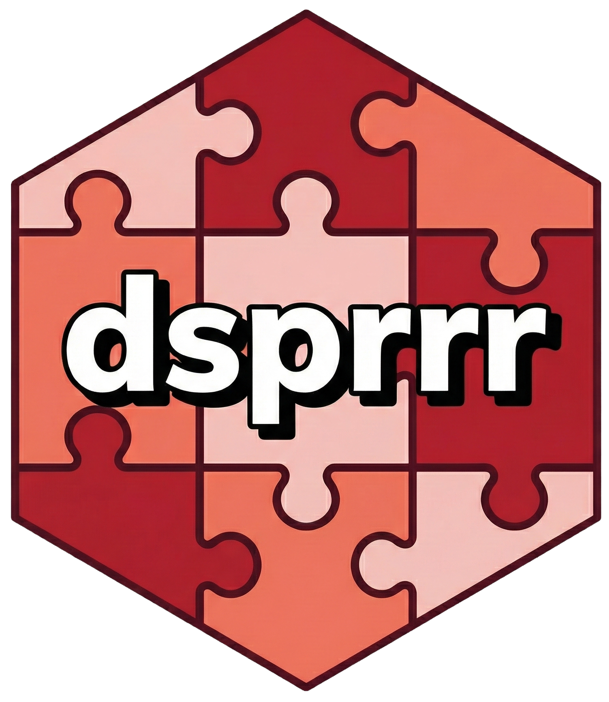

<!-- README.md is generated from README.Rmd. Please edit that file -->

```{r, include = FALSE}
knitr::opts_chunk$set(
  collapse = TRUE,
  comment = "#>",
  fig.path = "man/figures/README-",
  out.width = "100%"
)
# Attach here so the masking notices stay out of the README.
library(dsprrr)
```

# dsprrr 

<!-- badges: start -->
[](https://lifecycle.r-lib.org/articles/stages.html#experimental)
[](https://github.com/JamesHWade/dsprrr/actions/workflows/R-CMD-check.yaml)
[](https://app.codecov.io/gh/JamesHWade/dsprrr)
<!-- badges: end -->

dsprrr lets you write LLM features in R as small programs instead of prompt
strings. You declare a task's inputs and typed outputs; dsprrr builds the
prompt, calls the model through [ellmer](https://ellmer.tidyverse.org), and
returns an R list with the types you asked for. Once you have labeled
examples, you can score the program with a metric and let an optimizer tune
its instructions and few-shot examples against that score. The design follows
[DSPy](https://dspy.ai).

If you have a prompt that already works and no data to measure it against,
plain ellmer is enough. dsprrr earns its keep when you want typed outputs
across many inputs, a score you can track, or a prompt tuned on examples
instead of by hand.

## Installation

dsprrr is not on CRAN yet. Install the development version from GitHub:

```r
# install.packages("pak")
pak::pak("JamesHWade/dsprrr")
```

You also need credentials for a model provider, for example `OPENAI_API_KEY`
in your `.Renviron`.

## Example

A signature names the inputs and outputs of a task:

```{r signatures}
library(dsprrr)

signature(
  "review -> sentiment: enum('positive', 'negative', 'neutral'), stars: int, summary: string"
)
```

`module()` turns it into something you can run with any ellmer chat:

```r
chat <- ellmer::chat_openai(model = "gpt-4.1")

analyzer <- module(signature(
  "review -> sentiment: enum('positive', 'negative', 'neutral'), stars: int, summary: string"
))

result <- run(
  analyzer,
  review = "I've been using this blender for 6 months now. It's incredibly powerful and easy to clean. The only downside is it's quite loud. Overall, I'm very happy with it.",
  .llm = chat
)
str(result)
#> List of 3
#>  $ sentiment: chr "positive"
#>  $ stars    : int 4
#>  $ summary  : chr "Powerful and easy-to-clean blender, but a bit loud."
```

That output was recorded from a real call in the
[structured outputs tutorial](https://jameshwade.github.io/dsprrr/articles/tutorial-structured-outputs.html).

To measure and improve a module, give it labeled rows and a metric:

```r
scores <- evaluate(
  analyzer,
  labeled_reviews,
  metric = metric_exact_match(field = "sentiment"),
  .llm = chat
)
scores$mean_score

optimized <- analyzer |>
  compile(
    BootstrapFewShot(metric = metric_exact_match(field = "sentiment")),
    trainset = labeled_reviews,
    .llm = chat
  )
```

## What's included

| Area | Functions |
|---|---|
| Define tasks | `signature()`, `input()`, `with_instructions()` |
| Run them | `module()`, `run()`, `run_dataset()`, `run_async()`, `run_stream()` |
| Other ways to answer | `chain_of_thought()`, `react()`, `best_of_n()`, `refine()`, `ensemble()`, `program_of_thought()`, `code_act()` |
| Compose | `pipeline()`, `%>>%`, `module_fn()` |
| Measure | `evaluate()`, `metric_exact_match()`, `metric_f1()`, vitals bridges |
| Optimize | `compile()` with `LabeledFewShot()`, `BootstrapFewShot()`, `MIPROv2()`, `GEPA()`, `COPRO()`, `SIMBA()` and more; `optimize_grid()` |
| Inspect | `get_last_prompt()`, `inspect_history()`, `summarize_traces()`, `session_cost()` |
| Save | `save_program()`, `pin_module_config()` |

Experimental: `rlm_module()` (a model explores a large R object by writing
code), `flex()` (GEPA rewrites a whole program), `with_decisions()` and
`ReAnchor()` (calibrated decisions), `Omni()` and agentic optimization
harnesses.

## Learn more

The [documentation site](https://jameshwade.github.io/dsprrr/) has six
tutorials that start from a first call
([Tutorial 1](https://jameshwade.github.io/dsprrr/articles/tutorial-hello-world.html)),
how-to guides, concept articles, and a
[guide for DSPy users](https://jameshwade.github.io/dsprrr/articles/dspy-comparison.html).

## Status

Experimental. The API may change. See the
[open issues](https://github.com/JamesHWade/dsprrr/issues) for the roadmap.

## Acknowledgments

Built on [ellmer](https://ellmer.tidyverse.org) and
[S7](https://rconsortium.github.io/S7/). Inspired by
[DSPy](https://github.com/stanfordnlp/dspy).
