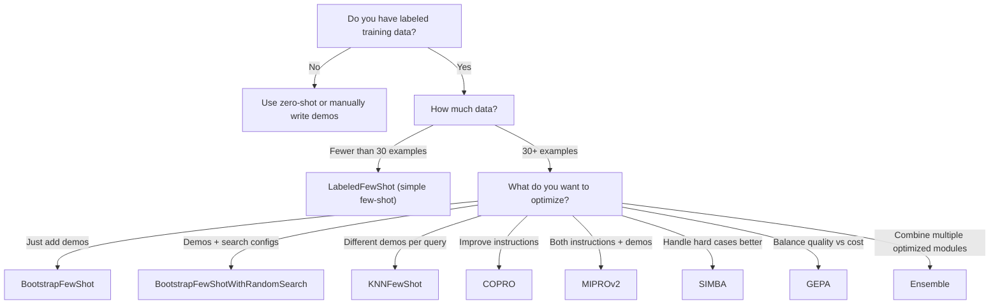

```{r}
#| include: false
knitr::opts_chunk$set(
  collapse = TRUE,
  comment = "#>",
  eval = FALSE
)
```

## Introduction

dsprrr provides a comprehensive suite of DSPy-inspired optimizers (teleprompters) for automatically improving your LLM programs. This guide covers the advanced optimizers beyond basic few-shot learning.

For basic optimization concepts, see `vignette("compilation-optimization")`.

## Quick Reference: Choosing an Optimizer

| If you want... | Use this optimizer | Complexity |
|----------------|-------------------|------------|
| Add labeled examples as demos | `LabeledFewShot` | Low |
| Bootstrap demos from LLM outputs | `BootstrapFewShot` | Medium |
| Bootstrap + search multiple configs | `BootstrapFewShotWithRandomSearch` | Medium |
| Dynamic per-query demo selection | `KNNFewShot` | Medium |
| Optimize instructions (not demos) | `COPRO` | Medium |
| Joint instruction + demo optimization | `MIPROv2` | High |
| Focus on hard examples | `SIMBA` | Medium |
| Multi-objective optimization | `GEPA` | High |
| Combine multiple strategies | `Ensemble` | Low |

### Decision Tree



## Dataset Sizing Guidance

| Dataset Size | Recommended Optimizers | Notes |
|--------------|----------------------|-------|
| 10-30 examples | `LabeledFewShot` | Minimal optimization |
| 30-100 examples | `BootstrapFewShot`, `COPRO` | Good starting point |
| 100-300 examples | `BootstrapFewShotWithRandomSearch`, `MIPROv2` | Meaningful search |
| 300+ examples | All optimizers | Full optimization potential |

**Key principles:**

- **Train/validation split**: Use 70-80% for training, 20-30% for validation
- **Diverse examples**: Ensure coverage of edge cases and all output categories
- **Quality over quantity**: 50 high-quality examples beat 500 noisy ones

```{r dataset-split}
library(dsprrr)

# Split your dataset properly
full_data <- tibble::tibble(

  question = c(...),  # Your examples
  answer = c(...)
)

set.seed(42)
n <- nrow(full_data)
train_idx <- sample(n, size = floor(0.7 * n))

trainset <- full_data[train_idx, ]
valset <- full_data[-train_idx, ]

# Or use the built-in helper
splits <- split_dataset(full_data, prop = 0.7, seed = 42)
trainset <- splits$train
valset <- splits$val
```

## Setup

```{r setup}
library(dsprrr)
library(ellmer)

# Configure your LLM
llm <- chat_openai(model = "gpt-4o-mini")

# Example training data for demonstrations
trainset <- dsp_trainset(
  question = c(
    "What is the capital of France?",
    "Who wrote Romeo and Juliet?",
    "What is the chemical symbol for gold?",
    "When did World War II end?",
    "What is the largest planet in our solar system?"
  ),
  answer = c(
    "Paris",
    "William Shakespeare",
    "Au",
    "1945",
    "Jupiter"
  )
)

# Base module to optimize
qa_module <- module(
  signature("question -> answer"),
  type = "predict"
)
```

## BootstrapFewShot

Bootstraps demonstrations by running the module on training examples and keeping successful outputs as demos.

**Best for:** When you want the LLM to generate its own demonstration format.

```{r bootstrap-fewshot}
tp <- BootstrapFewShot(
  metric = metric_exact_match(field = "answer"),
  max_bootstrapped_demos = 4L,
  max_labeled_demos = 2L,
  max_rounds = 3L,
  max_errors = 5L,
  seed = 42L
)

compiled <- compile(tp, qa_module, trainset, .llm = llm)

# Check what demos were bootstrapped
print(compiled$demos)

# Run the optimized module
result <- run(compiled, question = "What is the speed of light?", .llm = llm)
```

**Parameters:**

- `max_bootstrapped_demos`: Maximum LLM-generated demos to include
- `max_labeled_demos`: Maximum labeled examples from trainset
- `max_rounds`: Bootstrapping iterations
- `metric`: Evaluation metric (defaults to exact match)

## BootstrapFewShotWithRandomSearch

Combines bootstrapping with random search over configurations. Produces multiple candidate programs and selects the best.

**Best for:** When you want to explore different demo combinations and find the optimal configuration.

```{r bootstrap-rs}
tp <- BootstrapFewShotWithRandomSearch(
  metric = metric_exact_match(field = "answer"),
  max_bootstrapped_demos = 4L,
  max_labeled_demos = 2L,
  num_candidate_programs = 8L,
  num_threads = 4L,
  seed = 42L
)

compiled <- compile(tp, qa_module, trainset, valset = valset, .llm = llm)

# Access the best score
print(compiled$config$optimizer$best_score)

# Access candidate programs (list of program metadata)
candidates <- compiled$config$optimizer$candidate_programs
```

**Parameters:**

- `num_candidate_programs`: Number of configurations to try
- `num_threads`: Parallel evaluation threads
- All `BootstrapFewShot` parameters are inherited

**Tip:** Use `Ensemble` to combine the best optimized module with other strategies:
```{r bootstrap-to-ensemble}
# Compile with different strategies and ensemble them
mod1 <- compile(BootstrapFewShotWithRandomSearch(), qa_module, trainset, valset = valset, .llm = llm)
mod2 <- compile(COPRO(), qa_module, trainset, valset = valset, .llm = llm)
mod3 <- compile(LabeledFewShot(k = 3L), qa_module, trainset, .llm = llm)

# Ensemble with weights from validation scores
ens <- ensemble(
  list(mod1, mod2, mod3),
  reduce_fn = reduce_weighted_vote(),
  weights = c(0.90, 0.85, 0.80)  # Validation scores
)
```

## KNNFewShot

Selects demonstrations dynamically based on similarity to the input query. Uses embeddings to find the most relevant examples.

**Best for:** Tasks where example relevance varies significantly by query.

```{r knn-fewshot}
tp <- KNNFewShot(
  k = 3L,
  vectorizer = function(texts) {
    # Use any embedding function
    ragnar::embed_openai(texts)
  },
  cache_embeddings = TRUE  # Cache embeddings for efficiency
)

compiled <- compile(tp, qa_module, trainset, .llm = llm)

# Each query now gets personalized demos based on similarity
result <- run(compiled, question = "What is DNA made of?", .llm = llm)
```

**Parameters:**

- `k`: Number of nearest neighbors to use as demos
- `vectorizer`: Function that converts text to embeddings
- `cache_embeddings`: Boolean to enable embedding caching
- `input_text`: Which input field to use for similarity (default: first input)

## COPRO (Coordinate Prompt Optimization)

Optimizes instructions through coordinate ascent. Generates and tests instruction variants to find the best wording.

**Best for:** When your task benefits from better instructions rather than more demos.

```{r copro}
# Optionally use a different model for instruction generation
prompt_llm <- chat_openai(model = "gpt-4o")

tp <- COPRO(
  metric = metric_exact_match(field = "answer"),
  prompt_model = prompt_llm,  # Model to generate instruction candidates
  breadth = 5L,               # Candidates per iteration
  depth = 3L,                 # Number of iterations
  init_temperature = 1.4,
  seed = 42L
)

compiled <- compile(tp, qa_module, trainset, valset = valset, .llm = llm)

# Check the optimized instructions
print(compiled$signature@instructions)

# View optimization history
history <- compiled$config$optimizer$history
print(history)
```

**Parameters:**

- `breadth`: Number of instruction candidates per iteration
- `depth`: Number of coordinate ascent iterations
- `prompt_model`: LLM for generating instructions (can differ from task LLM)
- `init_temperature`: Temperature for instruction generation

**How it works:**

1. Starts with current instructions as baseline
2. Generates `breadth` instruction variants
3. Evaluates each on validation set
4. Keeps the best, uses failed examples to improve
5. Repeats for `depth` iterations

## MIPROv2

Multi-prompt Instruction Proposal Optimizer. Jointly optimizes instructions and demonstrations using Bayesian optimization.

**Best for:** Maximum optimization when you have sufficient data and compute budget.

```{r miprov2}
tp <- MIPROv2(
  metric = metric_exact_match(field = "answer"),
  auto = "medium",           # Preset: "light", "medium", or "heavy"
  num_candidates = 10L,      # Optional: override instruction candidates
  init_temperature = 1.0,
  prompt_model = chat_openai(model = "gpt-4o"),
  seed = 42L
)

compiled <- compile(tp, qa_module, trainset, valset = valset, .llm = llm)

# MIPROv2 optimizes both instructions and demos
print(compiled$signature@instructions)
print(compiled$demos)
```

**Parameters:**

- `auto`: Preset level - `"light"`, `"medium"`, or `"heavy"`
- `num_candidates`: Override instruction candidates to generate
- `prompt_model`: LLM for generating instruction proposals
- `max_bootstrapped_demos`, `max_labeled_demos`: Demo limits
- Supports `log_dir` for detailed trial logging

**Presets:**

```{r mipro-presets}
# Light preset (faster, less thorough)
tp_light <- MIPROv2(
  metric = metric_exact_match(),
  auto = "light"
)

# Heavy preset (slower, more thorough)
tp_heavy <- MIPROv2(
  metric = metric_exact_match(),
  auto = "heavy"
)
```

## SIMBA (Self-Improving Model-Based Augmentation)

Focuses optimization on hard examples that the model struggles with.

**Best for:** When your model performs well on average but fails on edge cases.

```{r simba}
tp <- SIMBA(
  metric = metric_exact_match(field = "answer"),
  bsize = 32L,            # Mini-batch size for evaluation
  num_candidates = 6L,    # Candidate demos per step
  max_steps = 8L,         # Optimization iterations
  max_demos = 4L,         # Maximum demos to include
  seed = 42L
)

compiled <- compile(tp, qa_module, trainset, valset = valset, .llm = llm)

# SIMBA iteratively improves on hard examples
print(compiled$demos)
```

**Parameters:**

- `bsize`: Mini-batch size for evaluation
- `num_candidates`: Number of demo candidates per step
- `max_steps`: Number of optimization iterations
- `max_demos`: Maximum demonstrations to include

**How it works:**

1. Identifies examples where the model fails
2. Generates targeted demos for those cases
3. Re-evaluates and repeats
4. Builds a demo set that covers edge cases

## GEPA (Guided Evolutionary Prompt Algorithm)

Multi-objective optimization balancing quality vs. cost (or other objectives).

**Best for:** Production systems where you need to balance accuracy against token usage or latency.

```{r gepa}
# Single-objective GEPA
tp <- GEPA(
  metric = metric_exact_match(field = "answer"),
  population_size = 20L,
  generations = 10L,
  mutation_rate = 0.1,
  crossover_rate = 0.7,
  seed = 42L
)

# Multi-objective GEPA with named metrics
tp_multi <- GEPA(
  metrics = list(
    quality = metric_exact_match(field = "answer"),
    brevity = function(pred, expected) 1 / (1 + nchar(as.character(pred$answer)))
  ),
  population_size = 20L,
  generations = 10L,
  selection = "pareto",  # Use Pareto selection for multi-objective
  seed = 42L
)

compiled <- compile(tp_multi, qa_module, trainset, valset = valset, .llm = llm)

# GEPA returns Pareto-optimal solutions for multi-objective
pareto <- compiled$config$optimizer$pareto_frontier
print(pareto)
```

**Parameters:**

- `metric`: Single metric function (for single-objective)
- `metrics`: Named list of metric functions (for multi-objective)
- `population_size`: Number of candidates per generation
- `generations`: Evolution iterations
- `selection`: Selection strategy (`"tournament"` or `"pareto"`)
- `mutation_rate`, `crossover_rate`: Genetic algorithm parameters

## Ensemble

Combines multiple compiled modules using voting or aggregation strategies.

**Best for:** Maximum robustness by combining diverse optimization strategies.

```{r ensemble}
# First, compile modules with different strategies
mod_bootstrap <- compile(BootstrapFewShot(), qa_module, trainset, .llm = llm)
mod_copro <- compile(COPRO(), qa_module, trainset, valset = valset, .llm = llm)
mod_knn <- compile(KNNFewShot(k = 3L), qa_module, trainset, .llm = llm)

# Combine with ensemble
ens <- ensemble(
  list(mod_bootstrap, mod_copro, mod_knn),
  reduce_fn = reduce_majority()
)

# Or use validation scores as weights
ens_weighted <- ensemble(
  list(mod_bootstrap, mod_copro, mod_knn),
  reduce_fn = reduce_weighted_vote(),
  weights = c(0.85, 0.90, 0.82)  # Validation scores
)

# Run the ensemble
result <- run(ens, question = "What is photosynthesis?", .llm = llm)
```

### Reduce Functions

```{r reduce-functions}
# Majority voting (default)
reduce_majority()

# Weighted voting using module weights
reduce_weighted_vote()

# Just take the first successful output
reduce_first()

# Score outputs with a metric
reduce_best_by_metric(
  metric = metric_f1(field = "answer")
)
```

### Ensemble via Teleprompter

```{r ensemble-teleprompter}
# Ensemble teleprompter wraps existing compiled modules
tp <- Ensemble(
  reduce_fn = reduce_weighted_vote(),
  weights = c(0.9, 0.85, 0.8)
)

ens <- compile(tp, programs = list(mod1, mod2, mod3))
```

## Tracking and Logging

All optimizers support logging for debugging and reproducibility.

### Trial Logging

```{r logging}
# Enable logging to a directory
tp <- BootstrapFewShotWithRandomSearch(
  metric = metric_exact_match(),
  log_dir = "optimization_logs/experiment_001",
  seed = 42L
)

compiled <- compile(tp, qa_module, trainset, .llm = llm)

# Log directory contains:
# - trials.jsonl: All trial results
# - best_program.rds: Serialized best module
# - config.json: Optimizer configuration
```

### Analyzing Trials

```{r analyze-trials}
# Read trial logs
trials <- read_trials_jsonl("optimization_logs/experiment_001/trials.jsonl")

# Examine trial results
print(trials)

# Plot optimization progress
library(ggplot2)
ggplot(trials, aes(x = trial_id, y = score)) +
  geom_line() +
  geom_point() +
  labs(title = "Optimization Progress", x = "Trial", y = "Score")
```

### Accessing Optimizer State

```{r optimizer-state}
# After compilation, access optimizer metadata
compiled$config$optimizer$name
compiled$config$optimizer$params
compiled$config$optimizer$best_score
compiled$config$optimizer$trials

# For BootstrapFewShotWithRandomSearch
compiled$config$optimizer$candidate_programs  # List of candidate metadata

# For COPRO
compiled$config$optimizer$history

# For GEPA (multi-objective)
compiled$config$optimizer$pareto_frontier
```

## Reproducibility

All optimizers support deterministic seeds:

```{r reproducibility}
# Set seed for reproducibility
tp <- BootstrapFewShot(
  metric = metric_exact_match(),
  seed = 42L
)

# Same seed = same results
compiled1 <- compile(tp, qa_module, trainset, .llm = llm)
compiled2 <- compile(tp, qa_module, trainset, .llm = llm)

# Demos will be identical
identical(compiled1$demos, compiled2$demos)  # TRUE
```

## Error Handling

Optimizers gracefully handle LLM errors:

```{r error-handling}
tp <- BootstrapFewShot(
  metric = metric_exact_match(),
  max_errors = 10L  # Allow up to 10 errors before failing
)

# Compilation continues despite some failed examples
compiled <- compile(tp, qa_module, trainset, .llm = llm)

# Check how many errors occurred
compiled$config$optimizer$n_errors
```

## Performance Tips

### 1. Start Simple, Then Advance

```{r progressive-optimization}
# Step 1: Try LabeledFewShot first
simple <- compile(LabeledFewShot(k = 3L), qa_module, trainset, .llm = llm)
simple_score <- evaluate(simple, valset, metric_exact_match(), .llm = llm)$mean_score

best_module <- simple
best_score <- simple_score

# Step 2: If not good enough, try bootstrapping
if (best_score < 0.8) {
  bootstrap <- compile(
    BootstrapFewShot(metric = metric_exact_match()),
    qa_module, trainset, .llm = llm
  )
  bootstrap_score <- evaluate(bootstrap, valset, metric_exact_match(), .llm = llm)$mean_score
  if (bootstrap_score > best_score) {
    best_module <- bootstrap
    best_score <- bootstrap_score
  }
}

# Step 3: If still not good enough, try COPRO
if (best_score < 0.85) {
  copro <- compile(
    COPRO(metric = metric_exact_match()),
    qa_module, trainset, valset = valset, .llm = llm
  )
  copro_score <- evaluate(copro, valset, metric_exact_match(), .llm = llm)$mean_score
  if (copro_score > best_score) {
    best_module <- copro
    best_score <- copro_score
  }
}

# Use the best performing module
print(paste("Best score:", best_score))
```

### 2. Use Parallel Evaluation

```{r parallel}
# BootstrapFewShotWithRandomSearch supports parallel evaluation
tp <- BootstrapFewShotWithRandomSearch(
  num_candidate_programs = 16L,
  num_threads = 8L  # Evaluate 8 candidates in parallel
)
```

### 3. Cache Embeddings for KNNFewShot

```{r caching}
# Enable embedding caching in KNNFewShot
tp <- KNNFewShot(
  k = 3L,
  vectorizer = ragnar::embed_openai,
  cache_embeddings = TRUE  # Cache computed embeddings
)

# Or create a caching vectorizer manually
cached_embed <- local({
  cache <- new.env(parent = emptyenv())
  function(texts) {
    key <- digest::digest(texts)
    if (!exists(key, envir = cache)) {
      cache[[key]] <- ragnar::embed_openai(texts)
    }
    cache[[key]]
  }
})

tp <- KNNFewShot(k = 3L, vectorizer = cached_embed)
```

### 4. Monitor Costs

```{r cost-monitoring}
# Track costs during optimization
session_cost()  # Total cost so far

# Costs are tracked in traces and trial logs
# Use session_cost() for aggregate view
```

## Summary

| Optimizer | Optimizes | Data Needs | Compute Cost |
|-----------|-----------|------------|--------------|
| `LabeledFewShot` | Demos | Low (10+) | Very Low |
| `BootstrapFewShot` | Demos | Medium (30+) | Low |
| `BootstrapFewShotWithRandomSearch` | Demos + Config | Medium (50+) | Medium |
| `KNNFewShot` | Dynamic Demos | Medium (50+) | Low |
| `COPRO` | Instructions | Medium (30+) | Medium |
| `MIPROv2` | Instructions + Demos | High (100+) | High |
| `SIMBA` | Hard Example Demos | Medium (50+) | Medium |
| `GEPA` | Multi-objective | High (100+) | High |
| `Ensemble` | Combines modules | N/A | Varies |

## Further Reading

**Tutorials:**
- [Finding Best Configuration](tutorial-optimize-your-module.html) — Hands-on grid search
- [Taking to Production](tutorial-deploy-to-production.html) — Deploy optimized modules

**How-to Guides:**
- [Compile & Optimize](compilation-optimization.html) — Basic optimization concepts
- [Evaluate with Vitals](vitals-recipes.html) — Integration with vitals package

**Concepts:**
- [How Optimization Works](concepts-optimization-theory.html) — Theory behind teleprompters
- [Why Metrics Matter](concepts-why-metrics-matter.html) — Choosing the right metric

**Reference:**
- [Quick Reference](cheatsheet.html) — Metrics and teleprompter syntax
