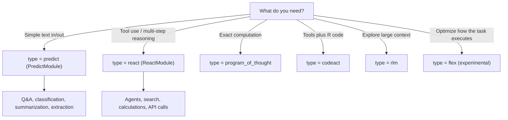
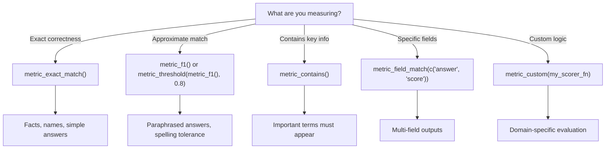

```{r}
#| include: false
# Skip evaluation during R CMD check or CI (cassettes may not match current code)
# This prevents build failures when VCR cassettes are stale
in_check <- nzchar(Sys.getenv("_R_CHECK_PACKAGE_NAME_")) ||
            identical(Sys.getenv("NOT_CRAN"), "false")

should_eval <- !in_check && dsprrr:::eval_vignette()

knitr::opts_chunk$set(
  collapse = TRUE,
  comment = "#>",
  eval = should_eval
)

# Only set up VCR if we're actually evaluating
if (should_eval) {
  # Ensure no cassettes are left over from previous vignettes
  if (!is.null(vcr::current_cassette())) {
    try(vcr::eject_cassette(), silent = TRUE)
  }

  # Configure vcr to match only on method + uri (not body)
  vcr::vcr_configure(
    dir = "_vcr",
    filter_request_headers = c("Authorization", "x-api-key"),
    match_requests_on = c("method", "uri")
  )

  vcr::setup_knitr()
}
```

A quick reference for common dsprrr operations.

## Setup & Configuration

```{r setup}
library(dsprrr)
library(ellmer)
```

### Configure Default LLM

```{r configure}
#| eval: false
# Auto-detect from environment variables (OPENAI_API_KEY, ANTHROPIC_API_KEY, etc.)
dsp_configure()

# Explicitly set provider and model
dsp_configure(provider = "openai", model = "gpt-4o-mini")
dsp_configure(provider = "anthropic", model = "claude-3-5-sonnet-latest")

# With additional parameters
dsp_configure(provider = "openai", model = "gpt-4o", temperature = 0.7)
```

### Check Configuration Status

```{r sitrep}
#| eval: false
dsprrr_sitrep()
#> dsprrr Configuration
#> ────────────────────────────────────────
#> Default Chat: ✓ Active
#>   Provider: OpenAI
#>   Model: gpt-4o-mini
```

### Default Chat Management

```{r default-chat}
#| eval: false
# Set a specific Chat as default
set_default_chat(chat_openai(model = "gpt-4o"))

# Get the current default Chat
chat <- get_default_chat()

# Clear the default (requires explicit .llm in calls)
clear_default_chat()
```

### Scoped LLM Override

```{r scoped-lm}
#| eval: false
# Temporarily use a different LLM for a block
claude <- chat_claude()
with_lm(claude, {
  run(module(signature("question -> answer")), question = "What is 2+2?")
  run(module(signature("text -> summary")), text = "Long article...")
})

# Function-scoped LLM (auto-cleans up on exit)
my_analysis <- function(data) {
  local_lm(chat_claude())
  run(module(signature("data -> summary")), data = data)
}
```

### Response Caching

```{r caching}
#| eval: false
# Caching is enabled by default (memory + disk)
# The disk tier uses a platform-specific per-user cache directory
configure_cache(
  enable_disk = TRUE,
  disk_private = TRUE,
  memory_max_entries = 1000L
)

# View cache performance
cache_stats()
#> Hit rate: 75%
#> Memory entries: 42

# Clear caches
clear_cache("all")    # Both memory and disk
clear_cache("memory") # Memory only

# Disable caching globally via environment variable
# DSPRRR_CACHE_ENABLED=false
```

Disk envelopes can contain raw request content, model outputs, and semantic
conversation turns. On Unix, dsprrr verifies owner-only directory (`0700`) and
file (`0600`) modes. On Windows, the per-user cache inherits account ACLs that
base R cannot verify. Administrators, extended ACLs, and network filesystems
remain outside this guarantee. On shared workstations, keep the default path;
in CI, disable caching or set a job-specific `DSPRRR_CACHE_PATH`.

If you explicitly configure a project-local path such as `.dsprrr_cache`, keep
it in `.gitignore`. Set `disk_private = FALSE` only when every cache reader and
writer is trusted; writable shared RDS caches can be poisoned. Existing
project-local caches must already meet the exact private-mode contract; remove
or review them before reuse.

---

## API Quick Reference

| Function | Purpose | Returns |
|----------|---------|---------|
| `signature()` | Define input/output schema | Typed signature object |
| `module()` | Create a reusable typed module | Module object |
| `run()` | Execute module on single input | Named output record(s) |
| `run_dataset()` | Execute on data frame | tibble with outputs |
| `evaluate()` | Compute metrics on test data | Evaluation result |
| `compile()` | Optimize with teleprompter | Compiled module |
| `with_lm()` | Scoped LLM override for code block | Block result |
| `local_lm()` | Function-scoped LLM override | Previous LLM |
| `configure_cache()` | Set cache options | Previous config |
| `cache_stats()` | View cache hit rate and size | Stats list |
| `get_last_prompt()` | Inspect last prompt sent | Prompt text |
| `export_traces()` | Inspect a module's execution traces | Trace tibble |

---

## Signature Notation

Signatures define what goes in and what comes out.

### Basic Format

```
inputs -> outputs
```

### Input Types

| Notation | Meaning |
|----------|---------|
| `question` | Single string input |
| `context, question` | Multiple inputs |
| `items: list[string]` | Typed list input |

### Output Types

| Notation | R/ellmer Type | Use Case |
|----------|---------------|----------|
| `answer` | `type_string()` | Free-form text |
| `answer: string` | `type_string()` | Explicit string |
| `score: int` | `type_integer()` | Whole numbers |
| `score: float` | `type_number()` | Decimal numbers |
| `score: number[0, 100]` | `type_number()` | Bounded numbers |
| `valid: bool` | `type_boolean()` | True/false |

### Constrained Types

| Notation | Description |
|----------|-------------|
| `sentiment: enum('pos', 'neg', 'neutral')` | Fixed choices |
| `label: Literal['a', 'b', 'c']` | Python-style enum |
| `summary: string[50, 200]` | String with length hints |

### Collection Types

| Notation | Description |
|----------|-------------|
| `tags: list[string]` | List of strings |
| `items: array(string)` | Array notation |
| `words: string[]` | Bracket notation |
| `data: dict[string, int]` | Dictionary/map |

### Optional Types

| Notation | Description |
|----------|-------------|
| `note: Optional[string]` | May be null |

### Multiple Outputs

```{r multi-output}
# Multiple output fields
sig <- signature("question -> answer, confidence: float")

# With different types
sig <- signature("text -> sentiment: enum('pos', 'neg'), score: float")
```

### With Instructions

```{r instructions}
sig <- signature(
  "context, question -> answer",
  instructions = "Answer based only on the provided context. Be concise."
)
```

---

## Creating Modules

### Build and Run a Module

```{r module-quick}
#| cassette: true
# With explicit Chat
chat <- chat_openai(model = "gpt-5-mini")
answerer <- module(signature("question -> answer"))
run(answerer, question = "What is 2+2?", .llm = chat)
```

The auto-detected form (when you have a default Chat configured):

```{r module-default-chat}
#| eval: false
# With auto-detected Chat (uses configured default)
run(answerer, question = "What is 2+2?")
```

### Reuse the Same Module

```{r reuse-module}
#| cassette: true
chat <- chat_openai(model = "gpt-5-mini")
classifier <- module(
  signature("text -> sentiment: enum('positive', 'negative', 'neutral')")
)

# Use repeatedly
run(classifier, text = "Love it!", .llm = chat)
run(classifier, text = "Hate it!", .llm = chat)
```

### Full Control: `signature()` + `module()`

```{r full-module}
# For optimization and complex configurations
sig <- signature("context, question -> answer")
mod <- module(sig)

# With custom template
mod <- module(
  sig,
  template = "Context:\n{context}\n\nQuestion: {question}"
)
```

---

## Module Types Decision Tree



| Type | Class | Use Case |
|------|-------|----------|
| `"predict"` | `PredictModule` | Standard text generation |
| `"react"` | `ReactModule` | Tool-calling agents |
| `"chain_of_thought"` | `PredictModule` | Step-by-step reasoning |
| `"multichain"` | `MultiChainComparisonModule` | Compare several reasoning chains |
| `"program_of_thought"` | `ProgramOfThoughtModule` | Generate and execute R code |
| `"codeact"` | `CodeActModule` | Combine tools and R code |
| `"rlm"` | `RLMModule` | Explore large context through a REPL |
| `"flex"` | `FlexModule` | Optimize predictor, R-logic, and tool strategy (experimental) |

### Code Runner Ownership

```{r code-runner-ownership}
#| eval: false
# Caller-owned and reused; the backend controls state persistence
pot <- program_of_thought("question -> answer", runner = runner)

# Fresh invocation-owned runner; dsprrr shuts it down exactly once
pot <- program_of_thought(
  "question -> answer",
  interpreter_factory = function() r_code_runner(timeout = 30)
)
```

Supply exactly one of `runner` and `interpreter_factory`. The factory is
zero-argument and is supported by ProgramOfThought, CodeAct, and RLM. dsprrr
never shuts down a directly supplied runner; persistence and reset support are
backend-specific.

### Experimental Flex

```{r flex-cheatsheet}
#| eval: false
program <- flex("question -> answer")
program$module_src       # Validated, read-only JSON
program$bind(candidate)  # Validate and replace transactionally

code_program <- flex(
  "question -> answer",
  module_src = "forward <- function(question) Prediction(answer = question)",
  interpreter_factory = function() mcp_repl_runner(timeout = 30),
  source_format = "r"
)
```

Use JSON Flex for a bounded Predict/Chain-of-Thought graph. Use executable Flex
when GEPA may need R control flow, dynamic predictors, or named tools; generated
source requires a fresh sandboxed interpreter. See [Flex: Optimize the Whole
Program](flex-optimization.html).

---

## Running Modules

### Single Execution

```{r run-single}
#| eval: false
# Using run()
result <- run(mod, question = "What is R?", .llm = chat_openai())

# Using predict method
result <- run(mod, question = "What is R?")
```

### Batch Processing

```{r run-batch}
#| eval: false
# Vector inputs
results <- run(mod, text = c("Great!", "Awful!", "Meh"))

# Data frame
new_data <- data.frame(text = c("A", "B", "C"))
results <- predict(mod, new_data = new_data)

# run_dataset for full control
results <- run_dataset(mod, dataset, .llm = llm)
```

### Show Prompt

```{r show-prompt}
#| eval: false
# See the prompt being sent
result <- run(mod, question = "Test", .llm = llm, .show_prompt = TRUE)
```

---

## Metrics & Evaluation

### Built-in Metrics

| Metric | Use Case |
|--------|----------|
| `metric_exact_match()` | Exact string equality |
| `metric_f1()` | Token overlap similarity |
| `metric_contains()` | Output contains expected substring |
| `metric_field_match(fields)` | Match specific output fields |
| `metric_threshold(metric, 0.8)` | Apply threshold to any metric |
| `metric_custom(fn)` | Custom scoring function |

### Metric Selection Guide



### Metric by Task Type

| Task | Recommended Metric | Why |
|------|-------------------|-----|
| Classification | `metric_exact_match()` | Answer must be exactly right |
| Extraction | `metric_exact_match(field = "...")` | Extract specific field |
| Generation | `metric_f1()` | Partial credit for overlap |
| Yes/No questions | `metric_exact_match(ignore_case = TRUE)` | "Yes" = "yes" |
| Contains keyword | `metric_contains()` | Answer includes key info |
| Complex evaluation | Custom function | Domain-specific logic |

### Running Evaluation

```{r evaluate}
#| eval: false
# Basic evaluation
result <- evaluate(mod, testset, metric = metric_exact_match(), .llm = llm)
result$mean_score
#> 0.85

# Evaluate an inline module
result <- evaluate(
  module(signature("question -> answer")),
  testset,
  metric = metric_exact_match(),
  .llm = llm
)
```

---

## Optimization

### Grid Search

```{r grid-search}
#| eval: false
# Search over parameters
optimize_grid(  mod,
  data = train_data,
  metric = metric_exact_match(),
  .llm = llm,
  parameters = list(
    prompt_style = c("concise", "detailed"),
    temperature = c(0.0, 0.3, 0.7)
  )
)

# Check results
module_trials(mod)
module_metrics(mod)
```

### Teleprompters

```{r teleprompters}
#| eval: false
# Few-shot learning
tp <- LabeledFewShot(k = 4L, metric = metric_exact_match())
compiled <- compile(mod, tp, trainset, .llm = llm)

# Grid search teleprompter
variants <- data.frame(
  id = c("concise", "thorough"),
  instructions = c("Be concise", "Be thorough")
)
tp <- GridSearchTeleprompter(
  variants = variants,
  metric = metric_exact_match()
)
compiled <- compile(mod, tp, trainset, .llm = llm)
```

---

## Debugging & Inspection

### Inspect Last Call

```{r last-prompt}
#| eval: false
# Get the last prompt sent
get_last_prompt()
#> ── Last Prompt ──
#> Model: gpt-4o-mini via OpenAI
#> Input tokens: 45
#>
#> Question: What is 2+2?
```

### Prompt History

```{r history}
#| eval: false
# View recent prompts
inspect_history(n = 5)

# Clear history
clear_prompt_history()
```

### Module Inspection

```{r mod-inspect}
#| eval: false
# Detailed module state
mod$inspect()

# Latest module trace
tail(export_traces(mod, include_outputs = TRUE), 1)
```

### Traces

```{r traces}
#| eval: false
# Get all traces from a module
traces <- mod$get_traces()

# Export to tibble
export_traces(mod)

# Summary statistics
summarize_traces(mod)

# Clear traces
clear_traces(mod)
```

---

## Production

### Save/Restore Configuration

```{r persistence}
#| eval: false
# Save optimized config to pins board
pin_module_config(board, "my-classifier-v1", mod)

# Restore later
artifact <- pins::pin_read(board, "my-classifier-v1")
mod <- restore_module_config(artifact)
```

### Vitals Integration

```{r vitals}
#| eval: false
# Convert module to vitals solver
solver <- as_vitals_solver(mod)

# Use with vitals::eval_task()
library(vitals)
result <- eval_task(my_task, solver)

# Convert vitals scorer to dsprrr metric
my_metric <- as_dsprrr_metric(vitals_scorer)
```

### Project Template

```{r template}
#| eval: false
# Create production-ready project structure
use_dsprrr_template("my_project")

# Validate a module and its evaluation data
validate_workflow(mod, data = test_data, board = board)
```

---

## Common Patterns

### RAG (Retrieval-Augmented Generation)

```{r rag}
#| eval: false
sig <- signature(
  "context, question -> answer",
  instructions = "Answer based only on the provided context."
)
mod <- module(sig)

# Use with retrieved context
result <- run(mod,
  context = retrieved_docs,
  question = user_query,
  .llm = llm
)
```

### Classification

```{r classification}
#| eval: false
classifier <- module(signature("text -> label: enum('spam', 'not_spam')"))

labels <- run_dataset(classifier, tibble::tibble(text = emails), .llm = chat)
```

### Extraction

```{r extraction}
#| eval: false
extractor <- module(
  signature("text -> entities: list[string], summary: string")
)

result <- run(extractor, text = document, .llm = chat)
result$entities
result$summary
```

### Chain of Thought (via instructions)

```{r cot}
sig <- signature(
  "problem -> answer",
  instructions = "Think step by step. Show your reasoning before the final answer."
)
```
